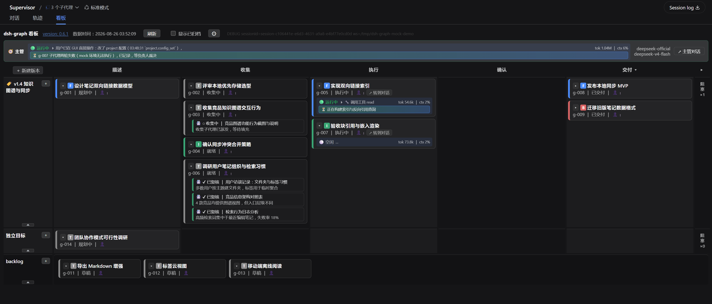
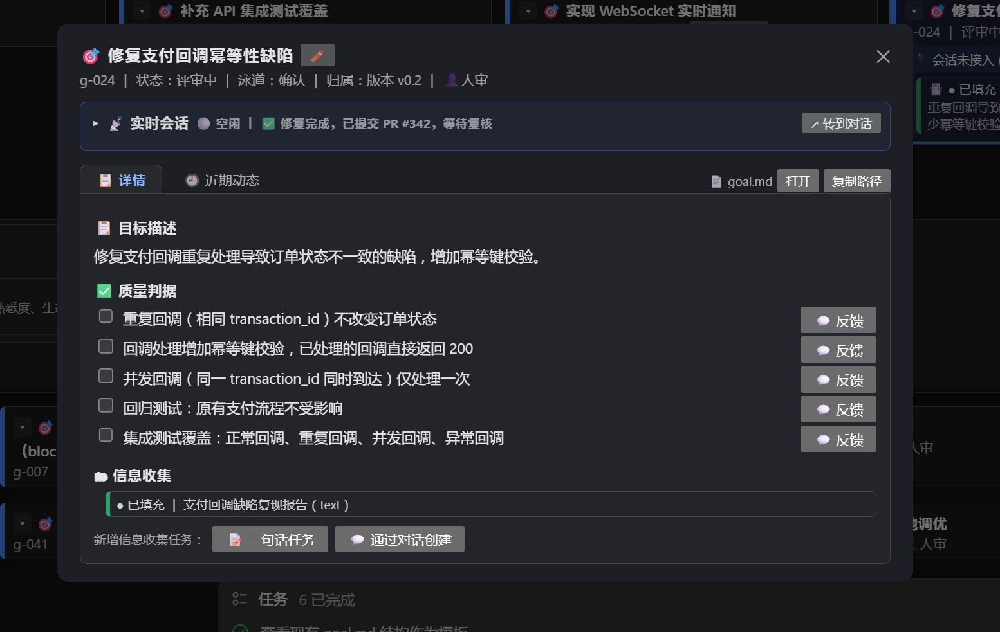

# dsh-graph

把工作组织成**目标看板**的 [DeepSeek Harness](https://github.com/deepseek-ai/deepseek-harness)（DSH）插件——基于图的目标管理（Graph-based Goal Management）。

单包发布：npm 包名 `dsh-graph`（当前版本 0.5.1），内部 host 插件 id 保留 `dsh-graph-host`。g-116 已将 host 与 client 合并进同一包（原 `dsh-graph-client` 已并入，0.4.0 起单包发布），一个包即同时提供：

- 面向 agent 的 22 个 `graph_*` 工具（覆盖目标全生命周期）+ `/api/dsh-graph*` REST 端点（看板投影 / 详情 / 写操作）；
- 浏览器二维泳道看板（`lib/client.js`），渲染进 `conversation.view` 槽。

数据以文件 + 事件流形式落在工作区的 `.dsh-graph` 目录，git 友好、可审计。

## 核心概念

- **基于图的目标管理**：目标是自足实体，自描述自然语言任务 + 动态生成的取证计划与质量判据；任务类型不预先模板化，结构化的是生命周期与求值语义，非结构化的是内容。
- **四阶段生命周期**：`描述 → 收集 → 执行 → 确认`，由引擎强制的状态机展开：
  `draft → planning → collecting → ready → in_progress → review → delivered`（任意阶段可进入 `blocked`，解除后回原阶段）。
- **判据先于执行**：进入执行前先登记质量判据，评审按逐条判据核验产出物。
- **上下文卡片**：目标 Runner 的种子上下文，生命周期 `empty → collecting → filled → reviewed`；形态分文本 / 文件 / 图片 / 数据，收集来源多态（人工 / supervisor / 收集子代理）。
- **排期**：Backlog（暂存池）↔ Version（可选聚合层，可并行的批量质量管理）↔ 独立目标（standalone，不经版本直接闭环）。看板泳道顺序是展示态，可拖拽调整。
- **换会话交接**：`graph_handoff` 生成交接文档（board 投影 + 长期记忆 + 环境事实），`graph_claim_supervisor` 由新会话接管。

## 安装

```sh
dsh plugin --profile <name> add dsh-graph
```

> 需要 Node ≥ 22（包内 core 为编译后 `.js`）。

## 提供的工具

22 个 `graph_*` 工具，按功能分组：

| 分组 | 工具 |
|------|------|
| 目标生命周期 | `graph_create_goal` · `graph_rename_goal` · `graph_amend_goal` · `graph_transition` · `graph_archive_goal` · `graph_unarchive_goal` · `graph_delete_goal` |
| 质量判据 | `graph_set_criteria` |
| 上下文卡片 | `graph_add_card` · `graph_fill_card` · `graph_review_card` · `graph_bind_collect_card` |
| 排期 | `graph_move_goal` |
| 执行派发 | `graph_start_attempt` |
| 校验 / 对账 | `graph_validate` · `graph_rebuild` |
| 状态汇报 | `graph_report_status` · `graph_report_supervisor_status` |
| 评审裁决 | `graph_resolve_accept` |
| 换会话 | `graph_handoff` · `graph_claim_supervisor` |
| 帮助 | `graph_help` |

各工具具体含义见 `dsh-graph-host/README.md` 或 `graph_help`。

## 看板（浏览器客户端）

浏览器二维泳道看板：横向泳道为状态阶段（backlog / 版本 / 目标），纵向为目标卡片；支持拖拽排期、判据 / 卡片抽屉、`graph_report_status` 与 `graph_report_supervisor_status` 的实时状态显示、阻塞折叠等。经 `dsh.client` 声明 + `exports["./client"]` 编入 `__DSH_BOOT__`。





## 数据目录

`<workspace>/.dsh-graph`：跟随调用会话的 workspace（`session.header.cwd`），数据落在每个项目自己的 `.dsh-graph`，git 友好。包含 `backlog/`、`goals/`、`versions/`、`events.jsonl`（事件流，唯一事实源）等。首次触达某 workspace 自动生成骨架，幂等、不建 demo 数据。

### 独立数据仓库模式（g-149）

`.dsh-graph` 可从父代码仓库解耦为**独立 Git 仓库**，实现代码提交/分支切换/worktree 合并不再覆盖看板状态。

**核心行为：**
- **Git linked-worktree canonicalization**：同一项目的主工作树、代码 worktree、GUI/host 和 `graph_*` 工具解析同一 canonical graph root，不会在 code worktree 下 init 第二份 `.dsh-graph`。通过 `git worktree list --porcelain` 发现主工作树，相对 `config.root` 归一到主树路径；显式绝对 `config.root` 跳过 Git 发现。
- **安全 fallback**：非 Git 目录、Git 不可用、或 `git worktree` 命令失败时，回退到 workspace-local 解析（当前行为不变）。
- **apply 不自动 init**：插件 `apply()` 不再以 `process.cwd()` 基准创建骨架。有 `sandboxPolicy.workspaceRoot`、显式 session cwd 或绝对 `config.root` 时正常 init；否则推迟到首次工具/REST 调用有明确 workspace 时。

**迁移（仅由脚本在显式 `--apply` 时执行，不做裸迁移）：**
```sh
# dry-run 预览（默认，不修改任何文件）
bash scripts/migrate-dsh-graph-repo.sh

# 执行迁移（创建内层 Git 仓库、父库 untrack/ignore）
bash scripts/migrate-dsh-graph-repo.sh --apply

# 可选：配置专用数据仓库远端（不自动 push）
bash scripts/migrate-dsh-graph-repo.sh --apply --remote <data-repo-url>
```

**事件流策略**：内层数据仓库**跟踪 `events.jsonl`**（R-02 审计与 rebuild 证据）。`order.json`、`index.json`、`handoffs/` 等派生/运行态内容由内层 `.gitignore` 排除。

**远端推送**：显式可选，绝不自动 push。设置远端后以 `git -C .dsh-graph push -u origin main` 手动推送。

**禁止事项**：
- supervisor 和子 Agent **不得**使用 `git add -f`、`git rm --cached` 等方式把 `.dsh-graph` 数据重新纳入父代码仓库 Git——数据归内层仓库管理。
- 不得在子目录或 linked worktree 下运行 `git -C .dsh-graph init`——canonical root 解析已自动归一到主工作树。

## 仓库结构（monorepo）

- `core/`——核心层源码（唯一事实源），经 `scripts/sync-core.sh` 编译成 `dsh-graph-host/core/*.js` 进发布包。
- `dsh-graph-host/`——单包发布物：`index.js`（工具 + REST 端点）、`lib/client.js`（看板）、`cordis.patch.yml`（`dsh.bundle`）、`supervisor-guide.md`、`README.md`、`LICENSE`。
- `schema/`、`docs/`、`scripts/`——数据 / 设计文档 / 构建脚本。

## 开发

```sh
bash scripts/sync-core.sh    # 修改 core 后同步进包
node --test core/tests/*.test.ts
```

## License

MIT（Copyright © 2026 miuzel）
