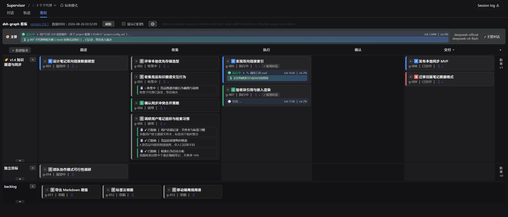
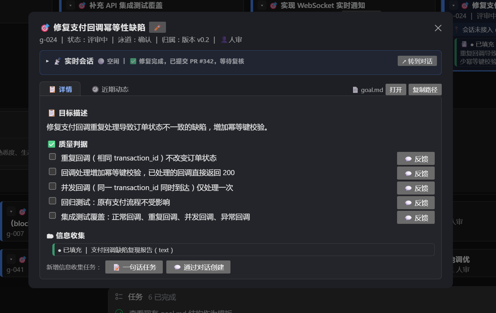

# dsh-graph

把工作组织成**目标看板**的 [DeepSeek Harness](https://github.com/deepseek-ai/deepseek-harness)（DSH）插件 —— 基于图的目标管理（Graph-based Goal Management）。

<p align="center">
  
</p>

<p align="center">
  <a href="https://www.npmjs.com/package/dsh-graph"></a>
  <a href="https://www.npmjs.com/package/dsh-graph"></a>
  <a href="https://github.com/miuzel/dsh-graph/blob/main/dsh-graph-host/package.json"></a>
  <a href="https://awesome-dsh-plugin.com"></a>
  <a href="https://github.com/miuzel/dsh-graph/blob/main/dsh-graph-host/LICENSE"></a>
  <a href="https://github.com/miuzel/dsh-graph/blob/main/dsh-graph-host/package.json"></a>
</p>

**当前版本 v0.20.0** —— npm 包名 `dsh-graph`，一个包同时提供面向 Agent 的 51 个 `graph_*` 工具（含 `/api/dsh-graph*` REST 端点）与内嵌 DSH Web 的二维泳道看板。

**最新亮点（v0.20.0）**

- **支持 DSH 0.2.1 系宿主**：宿主兼容范围放宽为 `>=0.1.5-rc.2 <0.2.2-0` —— 上界 `-0` 排除 `0.2.2` 的一切预发布与正式版，整条 `0.2.1` 线纳入范围，并已在隔离实例上以 `0.2.1-alpha.2` **未使用**任何版本豁免完成安装与启动。⚠️ 宿主的安装/启动门禁**只读 `peerDependencies`、不读 `engines.dsh`**，两处声明必须**同步**放宽——只改前者无效，安装期仍会被硬拒绝。
- **升级宿主后旧设置不再丢**：旧 `settings.yaml` 里的 `dsh-graph` 节会一次性、幂等地补进新的 `dsh-graph-host` 条目（重复执行不会重复导入，读取仍保留回退）；该升级路径已在真实宿主上做过端到端验证。
- **Agent Teams 协作模式（默认关闭）**：同一次执行内可扇出多个成员并行推进，并指定独立验证者对结果交叉核验；开关关闭时提示词与行为与旧版逐字一致。
- **不再产出坏数据、也不再静默失效**：设置写入的父级不是块式映射时直接拒绝（不再返回成功却写出非法 YAML）；工作树归属标记改为原子写入，中途失败不再留下半个标记、导致清理面保护静默失效。
- **设计过程看得见、状态不用猜**：看板标题栏新增「Graph 设计」入口，弹窗内嵌两张可交互流程图（随包发布、经只读路由提供），并有中英双语文档说明开发流程；新一轮对话开始时先显示「正在处理…」占位，不必盯着空白等首字。

变更史见 [CHANGELOG.md](https://github.com/miuzel/dsh-graph/blob/main/CHANGELOG.md)。

## 平台状态

| 平台 | 本版状态 |
|------|----------|
| Linux / WSL2 | ✅ 已实测通过（本版全量测试 fail 0） |
| 原生 Windows | ⏳ **本版未验证（待执行）**：`v0.20.0` 发布候选包**尚未**在原生 Windows 上执行真机门禁 ⇒ **不得读出「已通过」**；执行方式见[发布检查清单](docs/release-checklist-v0.20.0.md)（另起目标、经 interop 尝试）。历史真机记录只覆盖 v0.19.8 及更早的产品代码（[平台门禁](docs/platform-gate.md) §7.3 / §7.4 / §7.6），**不能替代本次候选包**。 |
| macOS | ⏳ **本版未验证**：`v0.20.0` 发布候选包**尚未**在原生 macOS 上执行真机门禁 ⇒ **不得读出「已通过」**。历史记录见[平台门禁](docs/platform-gate.md) §7.4 / §7.7，同样只覆盖 v0.19.8 及更早的产品代码。 |

三平台共用同一安装包。已知限制：① macOS 默认文件系统 APFS 大小写不敏感——仅大小写不同的目标编号 / 版本泳道会落到**同一实体**，请勿只用大小写区分；② macOS 上**经显式传入且含符号链接**的工作区路径（如位于 `/tmp`、`/var` 之下）会被拒绝并报 `graph root symlink is not allowed`，由 `process.cwd()` 推导的路径不受影响。

## 安装

```sh
dsh plugin --profile <name> add dsh-graph
```

需要 Node ≥ 22。依赖说明、宿主兼容范围（`engines.dsh` 声明与实测宿主）、侧边栏用法、数据目录等完整内容，见 **[dsh-graph-host/README.md](dsh-graph-host/README.md)**（即 npm 包内 README）。升级宿主后若 Web 看板半边不激活（`web boot: … did not activate`），见该 README 的「[升级残留自检与清理](dsh-graph-host/README.md#升级残留自检与清理)」。

## 核心概念

- **基于图的目标管理**：目标是自足实体 —— 自然语言任务 + 动态生成的取证计划与质量判据；任务类型不预先模板化，结构化的是生命周期与求值语义。
- **四阶段生命周期**：`描述 → 收集 → 执行 → 确认`，由引擎强制的状态机：`draft → planning → collecting → ready → in_progress → review → delivered`（任意阶段可进入 `blocked`）。
- **判据先于执行**：进入执行前先登记质量判据，评审按逐条判据核验产出物。
- **上下文卡片**：目标 Runner 的种子上下文，生命周期 `empty → collecting → filled → reviewed`；形态分文本 / 文件 / 图片 / 数据。
- **排期**：Backlog（暂存池）↔ Version（批量质量管理）↔ 独立目标（standalone）；看板泳道顺序是展示态，可拖拽调整。
- **分级评审与策略配置**：支持配置项目专属模块区域 `review.regions`、冻结契约 `review.contract_paths` 与排除前缀 `review.non_product_prefixes`，未登记区域自动安全升级 strict，空契约默认 M1 不触发。
- **换会话交接**：`graph_handoff` 生成交接文档（board 投影 + 长期记忆 + 环境事实），`graph_claim_supervisor` 由新会话幂等接管。
- **目标间关系**：目标之间可标记「取代 / 调整 / 补充 / 相关」四类关系（`graph_set_relation`，可增可删）；关系只记在目标 frontmatter 这一处真源，看板卡片与目标弹窗直接可见。
- **Profile 全局设置**：子代理默认 provider / model、推理档位、执行模式、提示词语言与补充提示词，可在「设置 → 看板设置」「右侧栏 → 插件 → dsh-graph」两处任一打开，两处读写同一份 profile 配置（workspace `project.yaml` 明确配置优先）。

## 提供的工具

51 个 `graph_*` 工具，按功能分组（逐个说明见 [dsh-graph-host/README.md](dsh-graph-host/README.md) 或 `graph_help`）：

| 分组 | 工具 |
|------|------|
| 目标生命周期 | `graph_create_goal` · `graph_rename_goal` · `graph_set_description` · `graph_set_goal_type` · `graph_set_goal_tags` · `graph_amend_goal` · `graph_transition` · `graph_postpone_goal` · `graph_archive_goal` · `graph_unarchive_goal` · `graph_delete_goal` · `graph_clean_worktree` · `graph_list_worktrees` |
| 目标关系 | `graph_set_relation` |
| 质量判据 | `graph_set_criteria` |
| 上下文卡片 | `graph_add_card` · `graph_fill_card` · `graph_review_card` · `graph_bind_collect_card` · `graph_delete_card` · `graph_convert_card_to_shared` · `graph_convert_card_to_owned` · `graph_attach_shared_card` · `graph_detach_shared_card` · `graph_list_shared_cards` |
| 附件 | `graph_store_attachment` · `graph_delete_attachment` |
| 排期 | `graph_move_goal` |
| 执行派发 | `graph_start_attempt` · `graph_start_review` · `graph_set_directive` · `graph_record_attempt_handoff` · `graph_unbind_goal_child` · `graph_abandon_attempt` |
| 记忆 | `graph_memory_add` · `graph_memory_recall` · `graph_memory_remove` · `graph_memory_replace` |
| 配置管理 | `graph_get_settings` · `graph_update_settings` |
| 校验 / 对账 | `graph_validate` · `graph_rebuild` |
| 状态汇报 | `graph_report_status` · `graph_report_supervisor_status` |
| 评审裁决 | `graph_resolve_accept` |
| 历史讨论 | `graph_add_comment` |
| 完成摘要 | `graph_write_results` · `graph_refresh_results` |
| 换会话 | `graph_handoff` · `graph_claim_supervisor` |
| 帮助 | `graph_help` |

## 看板（浏览器客户端）

浏览器二维泳道看板：横向为生命周期阶段列（描述 / 收集 / 执行 / 确认 / 交付 / 阻塞），每个版本一条泳道，另有 Backlog 与独立目标区；支持拖拽排期、判据 / 上下文卡片抽屉、实时状态显示、阻塞折叠等。以下为虚构演示数据（nebula-notes）截图：





## 侧边栏与数据目录

侧边栏入口、窄档（<480px）分档行为与「怎么把看板放进窄档」的实测说明，以及数据目录 `<workspace>/.dsh-graph`（纯文本 + 只追加 `events.jsonl`，git 友好、可 `graph_rebuild` 对账）的完整说明，均见 [dsh-graph-host/README.md](dsh-graph-host/README.md)。

## 仓库结构（monorepo）

- `core/` —— 核心层源码（唯一事实源），经 `scripts/sync-core.sh` 编译成 `dist/core/*.js` 进发布包；核心层不依赖 DSH。
- `dsh-graph-host/` —— 单包发布物源码：`index.js`（工具 + REST 端点）、`lib/client/*.js`（看板源模块，构建产物为 `dist/lib/client.js`）、`cordis.patch.yml`、`supervisor-guide.{zh,en}.md`、`README.md`、`LICENSE`。
- `schema/`、`docs/`、`scripts/` —— 数据 / 设计文档 / 构建脚本；一切构建产物落在 `dist/`（gitignored）。

## 开发

```sh
bash scripts/build.sh                 # 同步 core + 客户端产物 + 复制发布资产到 dist/
node --test core/tests/*.test.ts      # 全量测试
./node_modules/.bin/tsc --noEmit -p tsconfig.json
# 隔离测试实例（不碰主 GUI）：DSH_HOME 与 workspace 均在 ./tmp/dsh-test/ 下
bash scripts/dsh-test-web.sh <DSH版本> [--port PORT]
```

构建与实验一律在隔离 worktree（`.worktrees/<goal>-att-<NN>`）内进行；约定见 [AGENTS.md](AGENTS.md)，隔离实例参数与开发回路见 [docs/dev-instance-guide.md](docs/dev-instance-guide.md)。README 截图用 `scripts/dsh-graph-mock-seed.mjs` 生成虚构演示数据后复现。

## License

MIT（Copyright © 2026 miuzel）—— 见 [dsh-graph-host/LICENSE](dsh-graph-host/LICENSE)。
