# dsh-graph 设计哲学

> 英文版：[design-philosophy.en.md](design-philosophy.en.md)。两版结构对称（小节锚点集合逐字一致），
> 由 `core/tests/g460-design-philosophy-guard.test.ts` 结构守卫钉住。

<!-- sec: intro -->

## 0. 这篇文档写给谁

写给**第一次接触 dsh-graph 的人**：你知道什么是 AI coding agent（会读文件、改代码、跑命令的
自主代理），也知道「让 agent 干活」通常会失控在什么地方——范围漂移、自我宣布完成、没人能复核。
但你不知道 dsh-graph 把这件事组织成了什么形状。

本文只描述**今天代码里真实存在**的机制，并对每条行为论断给出真源引用（`文件:行号` 或小节名）。
凡是尚未实现、属于 1.0 设想的部分，一律集中写在 [§13](#13-10-路线未实现) 并显式标注
**「1.0 路线（未实现）」**，不混入正文的行为描述。

**一句话概括**：dsh-graph 把「一次开发」拆成 **目标（goal）→ 执行（attempt）→ 复核（review）→
交付（delivered）→ 发布（released）** 这条链，并在能写盘、能派发、能宣布完成的每个位置装一道
门禁；所有状态变化先写进只追加的事件流（`events.jsonl`），文件只是投影。

<!-- sec: overview -->

## 1. 主链总览

下面两张图都直接在 GitHub 上渲染，只画**今天已实现的流程**；尚未实现的产品规划不在图内，统一放在
[§13](#13-10-路线未实现)。两张图面向使用者：讲状态怎么流转、人和 AI 各自在什么时候做什么，
图内不出现文件、函数或内部产物名。

### 1.1 目标状态流转与合法迁移



[交互式版本](../dsh-graph-host/diagrams/design-philosophy.lifecycle.html) · [暗色版](assets/design-philosophy.lifecycle.dark.svg)

真源：状态集合 `core/machine.ts:10-19`（`STATUSES`）；合法边 `core/machine.ts:24-33`（`EDGES`）。

### 1.2 人 / 主管 / 执行子代理的角色与门禁主链


[交互式版本](../dsh-graph-host/diagrams/design-philosophy.workflow.html) · [暗色版](assets/design-philosophy.workflow.dark.svg)

真源：准入 `core/ops.ts:7771`（`assertExecutionAdmission`）；隔离 `core/worktree.ts:784`
（`resolveWorktreeIsolationDecision`）；结果面 `core/ops.ts:8653`（`writeAttemptResults`）；
评审留痕 `core/ops.ts:6914`（`reviewsDir`）。

<!-- sec: lifecycle -->

## 2. 目标生命周期与状态机

### 2.1 状态集合

`core/machine.ts:10-19` 定义了 8 个状态：`draft`、`planning`、`collecting`、`ready`、
`in_progress`、`review`、`delivered`、`blocked`。这是一个**闭集**——不是约定，而是类型与运行时
校验的共同真源。

### 2.2 合法迁移

合法边写在 `core/machine.ts:24-33` 的 `EDGES` 里，是一张有向图；`blocked` 特殊处理，没有出边。
其中几条边附带设计理由（源码注释里也逐条写了）：

- `planning → ready`：没有收集需求时直达，不为走流程而收集（`core/machine.ts:26`）；
- `collecting → in_progress`：人工拖动视为授权，可跳过 `ready`（`core/machine.ts:27`）；
- `in_progress → collecting`：中断后回退重新收集（`core/machine.ts:29`）；
- `review → in_progress`：打回（`core/machine.ts:30`）；
- `delivered → review`：负责人备注后回 `review` 补充或修 bug（`core/machine.ts:31`）。

### 2.3 非法迁移如何被拒绝

所有迁移都过 `assertTransition`（`core/machine.ts:50-91`），它在写盘之前抛 `GraphError`：

| 情形 | 行为 | 真源 |
| --- | --- | --- |
| 当前状态或目标状态不在闭集内 | 拒绝（`当前状态非法` / `目标状态非法`） | `core/machine.ts:56-61` |
| `from === to` | 拒绝（`状态未变化`） | `core/machine.ts:62` |
| 边不在 `EDGES` 内 | 拒绝（`非法迁移：from → to`） | `core/machine.ts:70-72` |
| `blocked` 缺少 `blocked_from` | 拒绝 | `core/machine.ts:65-66` |
| 从 `blocked` 解到非原状态 | 拒绝（`只能解除回原状态`） | `core/machine.ts:67-69` |
| 进入 `blocked` 未给 `reason` | 拒绝 | `core/machine.ts:74-78` |
| 进入 `in_progress` 缺 `rules_snapshot` | 拒绝 | `core/machine.ts:81-83` |
| 进入 `in_progress` 时判据小节为空 | 拒绝 | `core/machine.ts:84-86` |
| 进入 `in_progress` 无 `criteria.confirmed` 事件 | 拒绝 | `core/machine.ts:87-89` |

另外，位于 `backlog/` 的草稿目标不允许做阶段迁移——必须先排期进版本或独立目标
（`core/ops.ts:2923-2925`）。

### 2.4 状态是投影，不是真源

迁移统一走 `transition()`（`core/ops.ts:2918`），它是**事件先行**的：先追加 `goal.transition`
事件，事件落盘成功后才写 `goal.md`（`core/ops.ts:2945-2959`）。因此 `events.jsonl` 是唯一真源，
`goal.md` 的 `status` 只是投影；`graph_rebuild` 会重放 `goal.created` / `goal.transition`
并报告 frontmatter 与事件流的 drift（`core/ops.ts:3990`）。
看板上的列位置也直接等于 `status`——所以卡片滞留列里就是在撒谎（`dsh-graph-host/supervisor-guide.zh.md:84-85`）。

<!-- sec: criteria-gate -->

## 3. 判据门禁与人工 gate

### 3.1 判据先于执行

判据由 `graph_set_criteria` 登记（`core/ops.ts:2609`）：列表为空直接拒绝
（`core/ops.ts:2613`），写入时快照规则库版本（`rules_snapshot`，`core/ops.ts:2626-2628`），
并追加 `criteria.confirmed` 事件（`core/ops.ts:2629-2638`）。
「判据小节是否有实质内容」由 `criteriaPresent` 判定，它会剥掉 HTML 注释与模板占位行
（`core/model.ts:193-195`，占位符集合见 `core/model.ts:186-190`）。

这条门禁在**两个**位置生效：

1. 状态机本身：`in_progress` 迁移要求 `rules_snapshot` + 判据非空 + `criteria.confirmed`
   三者齐备（`core/machine.ts:80-90`）；
2. 派发准入：`assertExecutionAdmission` 在**启动子代理之前**用同一套状态机不变式预演
   `in_progress` 迁移，不通过就抛错，且**零副作用**（不建 attempt、不启动子代理）
   （`core/ops.ts:7771-7833`，注释明确写「绝不先启动子代理再吞掉迁移失败」）。

准入还额外拒绝四类位置/状态：`backlog`（`core/ops.ts:7781-7783`）、`draft`
（`core/ops.ts:7785-7787`）、`blocked`（`core/ops.ts:7788-7790`）、`delivered`
（`core/ops.ts:7791-7793`）；并对 `collecting` / `ready` 追加「目标描述非空」检查
（`core/ops.ts:7753`、`core/ops.ts:7795-7805`）。

### 3.2 `review → delivered` 必须人工 verdict

复核通过由 `graph_resolve_accept` 落地：它追加 `review.passed` 事件，然后走
`review → delivered` 迁移（`core/ops.ts:12693-12713`，`applyAcceptMapping`）。
发出复核请求则是 `review.requested` 事件（`core/ops.ts:12388-12411`）。

**但这里必须说清一个诚实边界**：`delivered` 的人工 gate 是**主管纪律约束，不是引擎强制**。
`graph_resolve_accept` 与 `graph_transition(to='delivered')` 都不校验任何人类信号——没有 token、
没有 GUI 确认，事件载荷也不记录批准者；引擎无从区分「负责人裁决过」与「主管自放」
（`dsh-graph-host/supervisor-guide.zh.md:148`）。这是**刻意保留的弹性**：强制只会诱发 agent
取巧。纪律在主管身上，不在引擎里。相应地，主管守则把「审核」列为四类默认需负责人确认的操作之一
（`dsh-graph-host/supervisor-guide.zh.md:36-43`），执行子代理被明确禁止自移 `review→delivered`
（`dsh-graph-host/supervisor-guide.zh.md:306-307`）。

### 3.3 机器快速放行不是人工 gate 的替代

`review.policy` 取三值 `auto` / `strict` / `none`（未配置时按目标类型派生：`patch`/`chore` → `auto`，
其余 → `strict`）（`dsh-graph-host/supervisor-guide.zh.md:132-136`）。只有 `auto` 允许
`fast_track`，且四项机器门禁必须全绿：

1. 全量测试 `exit_code=0` 且 `fail=0`（**调用方证据**，引擎不复跑）；
2. 类型检查 `exit_code=0`（**调用方证据**）；
3. 变更规模（**引擎 Git 自算**）：产品代码增删 <150 行、无未跟踪用户文件；
4. 全部判据以 `✅已验` 结尾（**引擎自算**）。

证据分层与 fail-safe（任一信号取不到即不放行）见
`dsh-graph-host/supervisor-guide.zh.md:140-146`；实现入口 `core/ops.ts:12504`（`resolveAccept`）。
**`fast_track` 只免除机器证据收集，未免除负责人对 `delivered` 的最终裁决**
（`dsh-graph-host/supervisor-guide.zh.md:150`）。

<!-- sec: dispatch -->

## 4. 派发与隔离三件套

### 4.1 派发走一个工具

执行由 `graph_start_attempt` 派发（`core/ops.ts:7867`，`startAttempt`）。派发前先过准入门禁
（§3.1），准入通过后**先**落地 `in_progress` 迁移，**再**创建 attempt 目录并启动子代理
（`core/ops.ts:7846`，`ensureExecutionInProgress`）。顺序是刻意的：迁移被拒时不留下任何
attempt 痕迹。

### 4.2 隔离决策：显式 > 脏工作区 > 类型默认

是否建独立 worktree 由 `resolveWorktreeIsolationDecision` 决定（`core/worktree.ts:784-826`），
规则自上而下短路求值：

| 规则 | 条件 | 结果 | `reason` |
| --- | --- | --- | --- |
| 1 | 显式传了 `worktree` | 尊重显式值 | `explicit` |
| 2 | 探测到可靠的不干净工作区（`clean === false`） | **一律升级为隔离**（连 `patch`/`chore`/`task` 也建树） | `dirty_workspace` |
| 3 | 探测到干净（`clean === true`）或未探测 | 按类型默认 | `type_default` |
| 4 | 探测不可靠（`clean === null`） | 按类型默认，但如实标注未知 | `type_default_unknown` |

类型默认：`patch`/`chore`/`task` 不建树，`feature`/`bug`/`improvement` 建树
（`core/worktree.ts:334`，`defaultWorktreeForGoalType`）。
建树本身由 `prepareAttemptWorktree` 完成（`core/worktree.ts:845`），命名约定
`.worktrees/g-<goal>-att-<NN>`，分支同名。它在子代理启动**之前同步执行**，两者之间没有
`await`，所以子代理启动时工作树必已创建并注册；建树失败一律抛 `GraphError`，**绝不静默降级为
主树执行**（`AGENTS.md`「派发即隔离：返回语义与『隔离三件套核验』」）。

派发响应是**白名单**构造的，返回 `isolated` / `worktree` / `worktree_reason` /
`worktree_created` / `worktree_reused`，主管据此判定隔离是否真的发生（同上 AGENTS.md 小节）。

### 4.3 隔离三件套核验

派发后按三条独立证据核验（`AGENTS.md`「派发即隔离」小节逐条定义）：

1. `git worktree list` 命中该 attempt 的工作树路径（`.worktrees/<goal>-att-<NN>`，两位序号）；
2. 主树 `git status --porcelain` 为 0 改动；
3. 主树 `dist/` mtime 未变（未在主树构建）。

三条任一不合即按「未隔离」处理。注意 `isolated:false` **不等于隔离失败**——它表示本次按策略
在集成工作区根目录运行；确实需要隔离时应在派发时显式传 `worktree:true`。

### 4.4 为什么主树不能跑构建

`dist/` 是**正在运行的宿主**的资产来源，且宿主对 `dist/prompts/*.md` 是**每次调用现读**
（非启动缓存）。在主树跑构建会与运行中的宿主争用该目录，历史上直接击杀过在途 attempt
（`AGENTS.md`「Build Isolation」记录了 `dsh-graph prompt asset missing or unreadable` 的真实故障）。
两条具体陷阱：`pnpm typecheck` 会连带触发 `prepare`（= 完整构建），所以主树改用
`./node_modules/.bin/tsc --noEmit -p tsconfig.json`；`pnpm check:dist` **也不是**只读入口
（pnpm ≥ 11 的 `verifyDepsBeforeRun` 会隐式 `pnpm install` ⇒ 完整构建），纯只读检查用
`node --test core/tests/dist-freshness-g312.test.ts`（`AGENTS.md`「Build Isolation」，
g-408 实测记录在案）。构建本身是**原子发布**的：先组装到仓库内暂存目录，全部成功后用一次
`renameat2(RENAME_EXCHANGE)` 换树，失败则旧 `dist/` 逐字节不变（`AGENTS.md`「Atomic publish (g-348)」）。

<!-- sec: attempt -->

## 5. attempt 与结果面纪律

### 5.1 attempt 是唯一执行收口

一个目标同一时刻只投影一个活跃 attempt；attempt 目录落在目标目录下，`attempt.started` /
`attempt.bound` 等事件先行写入（`core/ops.ts:8409`，`bindAttemptChild`；事件先行的收敛记录见
`docs/event-first-commit-contract.zh.md:116-124`）。执行子代理的状态自述通过
`graph_report_status` 写进 attempt（`core/ops.ts:8366`），**主管不得替子代理汇报**——那句话是
子代理的自述，代劳即伪造进展（`dsh-graph-host/supervisor-guide.zh.md:285-288`）。

### 5.2 自动截获：零 LLM 调用的结果面

宿主在子代理结束时发 `subagent/end`，插件据此把子代理最后一条 assistant 文本自动落盘为
`results-att-<attempt>.md`——**全程零 LLM 调用**（`core/ops.ts:8644-8670`，注释明写
「零 token：文本来自宿主 subagent/end 事件，非 LLM 调用」）。已知来源取值域是开放集合：
`subagent/end` / `child_error` / `abandon` / `detach` / `manual` / `history` / `deterministic` /
`llm`（`core/ops.ts:8483`，`ATTEMPT_RESULTS_SOURCES`）；未知来源原样落盘，缺失默认为
`subagent/end`（`core/ops.ts:8664-8668`）。单文件上限 64 KiB（`core/ops.ts:8472`）。

### 5.3 结果真空补救

「自动截获」会失败——宿主中断、进程被杀、主管自己做了无子代理的小改动。此时**不许留结果真空**，
补写有两条工具路径：

- `graph_write_results`：手工补写某次 attempt 的完成摘要（`source=manual`，零 LLM 调用）；
- `graph_refresh_results`：重写目标级 `results.md`（`core/ops.ts:9514`，`refreshGoalResults`），
  旧版先归档为 `results-archive-YYYYMMDDTHHMMSS.md` 再写新版（归档命名真源
  `core/ops.ts:8917-8919`，归档实现 `core/ops.ts:8933-8960`）。

`graph_refresh_results` 有三种写入模式，且**默认零 LLM 调用**：省略 `content` 时由目标历史
零 LLM 拼装（`source=deterministic`）；传 `content` 时采用调用方正文（`source=manual`）；
传 `llm:true` 时派**专用摘要子代理**（role=summarizer）结合目标详情写「改动 / 影响 / 值得注意」
（`source=llm`），并以历史指纹为缓存键，历史未变则命中缓存不再调用
（`core/ops.ts:8493-8497` 定义三种 source 常量）。

<!-- sec: review -->

## 6. 独立复核：词表与真源

### 6.1 结论词表是闭集

评审结论只有三个值：`PASS` / `BLOCK` / `UNVERIFIED`，定义在 `core/ops.ts:6866`
（`REVIEW_CONCLUSIONS`），**不得使用 `FAIL`**。日常复核的分级口径还包含第四类
`OUT-OF-SCOPE`（超出当前威胁模型或版本范围，不自动升级）——它不影响上面的闭集，
因为闭集管的是**写进评审记录的结论**（`dsh-graph-host/supervisor-guide.zh.md:118-122`）。

`BLOCK` 的触发面被明确收窄：跨 workspace 越界、凭据泄漏、明显路径错误、普通并发数据丢失、
未授权破坏性写入、错误输入崩溃必须阻断；理论网络攻击、同 UID 恶意竞争、内核级全量 TOCTOU、
分布式一致性缺陷等**不自动 BLOCK**（`dsh-graph-host/supervisor-guide.zh.md:120-124`）。

### 6.2 独立性真源：`reviews/<review_id>.md`

一次评审是**既有执行 attempt 的附属记录**——不新建 attempt、不迁移状态、不覆盖作者
`child_id` 与 `results-att-*.md`（`dsh-graph-host/supervisor-guide.zh.md:148`）。
结论独立落盘在两个位置：

- 目录 `<goalDir>/reviews/`：`core/ops.ts:6914`（`reviewsDir`），注释明确「与 `attempts/` 并列，
  **绝不写入 `attempts/`**」；
- 记录文件 `reviews/<review_id>.md`：`core/ops.ts:6923`（`reviewRecordFile`），
  `review_id` 形态 `rev-att-<attempt>-<NN>`（正则 `core/ops.ts:6908`，序号取已存在文件最大值 +1，
  不重用编号）。

评审事件名本身也是闭集，写入侧 fail-closed：不在 `REVIEW_EVENT_NAMES` 内即抛错
（`core/ops.ts:6877-6903`）。

### 6.3 什么**不算**独立

这是这套设计里最容易被自欺的一环，所以写在最显眼处：

- **作者自报不算独立验证**（作者自己的输出、自查）；
- **作者自派评审不算独立**——留痕记为 `self_requested`，结构守卫遇到「`self_requested`
  却声称 independent」直接判红（`core/ops.ts:7529`，文案「self_requested（作者自派）不得冒充
  独立验证」）；
- **作者 child 冒充独立**同样判红（`core/ops.ts:7440-7537` 的
  `fanoutIndependentVerificationProblems` / `auditFanoutIndependentVerification`）。

合法留痕的「反向边界」也被写死：如实标注 `source=self_requested` 或 `source=author` 的
**不判红**（不误伤诚实记录），但它也不构成独立验证（`core/ops.ts:7537`）。

### 6.4 分级策略与「未独立评审」标注

`strict` 表示必须派独立（无作者偏见的）评审子代理、禁止 `fast_track`
（`dsh-graph-host/supervisor-guide.zh.md:134`）。若 `strict` 目标接受时当前候选没有可审计的
独立评审 PASS 记录，引擎会追加一条**目标级可见化标注** `review.independent_missing`
（`core/ops.ts:7676-7706`），把 policy、strict 原因、当前候选 SHA 都记进去——但
**不阻断 accept**。看板徽标与 `review_state.independent_ok` 针对的是
`current_candidate_sha`（最近一次被请求评审的候选），**不等于 HEAD**
（`dsh-graph-host/supervisor-guide.zh.md:149`）。

### 6.5 诚实边界：评审不是引擎门禁

必须说清楚：`strict` 的「必须派独立评审」在插件层**只有判定与指南约束，不是引擎强制**；
未派独立评审时看板与事件流如实标注「未独立评审」但不阻断 accept
（`dsh-graph-host/supervisor-guide.zh.md:148`）。派发入口是
`graph_start_review(goal, attempt, candidate_commit)` / `POST /api/dsh-graph/start-review`（同上）。

<!-- sec: release -->

## 7. 版本泳道与发布红线

### 7.1 版本泳道是排期，不是状态

看板纵向分三类泳道：版本（`versions/<slug>/goals/`）、暂存池 `backlog/`、独立目标 `goals/`；
`graph_move_goal` 即文件移动，也就是归属变更（工具描述与 `core/ops.ts` 的
`classifyGoalRel` `core/ops.ts:326` 是归属判定真源）。目标间关系（取代 / 调整 / 补充 / 相关）
只写在各目标 frontmatter 的 `meta.relations`（`core/ops.ts:3047`，`RELATION_TYPES`），
`meta.depends_on` 独立存放，且会做替代环检测（`core/ops.ts:3077`，`RELATION_CYCLE_TYPES`）。

### 7.2 `released` 有准入条件

`releaseVersion`（`core/version-lane.ts:471-521`）在写任何状态之前做两件事：

1. **actor 身份**：仅 `human:*` 或 `supervisor:*` 可发布，`agent:*` 被拒绝
   （`core/version-lane.ts:484-486`，文案「执行子代理不能直接发布」）；
2. **版本完成度**：版本内全部**非归档**目标必须为 `delivered`，否则返回阻塞清单、不写任何状态
   （`core/version-lane.ts:498-503`；清单由 `validateVersionRelease` 生成
   `core/version-lane.ts:439-469`）。

通过后事件先行：先写 `version.released`，再更新 `version.md` 的 `status`
（`core/version-lane.ts:505-521`）。`setVersionStatus` 的合法目标状态是
`["planning", "active"]`，**不含** `released`（`core/version-lane.ts:521` 之后的
`VERSION_STATUS_ALLOWLIST`）。

### 7.3 三条跨版本发布红线

`AGENTS.md`「发布门禁（Release Gate）」是唯一真源，本段不改动它，只复述：

1. **Windows 兼容性**：每个版本发布前必须在**原生 Windows** 上做一次兼容性测试
   （T1–T5 分层检查，执行件 `scripts/win-smoke-test.mjs`）；Linux/WSL2 全绿**不能替代**
   Windows 真机结论；Windows 验证缺失时 README 须如实标注「Windows 未验证」；
2. **版本号一致性**：发布前必须核对 `package.json` version、`PLUGIN_VERSION`、README 中的
   版本表述一致——**这条只有人工核对才能发现**（0.11.0 教训：常量不参与构建校验）；
3. **产物传递纪律**：跨机器传递唯一渠道为 tarball，记录 sha256 对账
   （registry 会重写 tarball，故线上 sha256 必然 ≠ 本地 pack sha256，registry 侧必须改用
   内容级对账——`docs/release-handbook.md:120-141`）。

本仓库中这三处版本串的具体落点是：打包版本 `dsh-graph-host/package.json:3`（`version`）、
客户端常量 `dsh-graph-host/lib/client/constants.js:12`（`PLUGIN_VERSION`）、README 的
「当前版本」表述（`dsh-graph-host/README.md:43` 与 `:276`）。

<!-- sec: memory -->

## 8. 记忆分级

记忆有两条**硬上限**，真源常量 `core/ops.ts:11965-11971`（`MEMORY_LIMITS`）：

| scope | 单条上限 | 用途 |
| --- | --- | --- |
| `standing` | **200 字**（码点计数） | 常驻注入，占系统 Prompt |
| `on_demand` | 1000 字 | 按需检索，不占常驻 Prompt |

超限直接抛错（`core/ops.ts:11994-11999`，`validateMemoryInput`）。写入侧还拒绝控制字符与
疑似凭据/token 的文本（`core/ops.ts:11978-11984`，`validateMemoryText`）。

**分级决策铁律**：一切自发总结、技术经验、方案决策 100% 默认 `on_demand`；只有「人类明确要求
常驻」或「涉及工作区隔离/不可违背的安全禁令」才允许 `standing`
（`dsh-graph-host/supervisor-guide.zh.md:78-80`）。常驻注入还有独立的总预算
`MEMORY_INJECT_TOTAL_BUDGET = 4000`（`core/ops.ts:11973`），渲染时按「关键约束 → 人类授权 →
重要度 → 更新时间」排序（`core/ops.ts:1760`，`formatStandingMemorySection`）；
预算挤不下全部关键约束时**不静默丢弃**，而是给出有界的溢出提示（`core/ops.ts:1892`）。

结构化记忆的真源是 `memory/memory.jsonl`（事件流），读取走重放
（`core/events.ts:302`，`replayMemory`）；`on_demand` 条目用 `graph_memory_recall` 按需检索，
不需要任何索引文件（`dsh-graph-host/supervisor-guide.zh.md:19-20`、`:413`）。

<!-- sec: cards -->

## 9. 共享卡与附件

### 9.1 上下文卡片

卡片生命周期是四态闭集 `empty → collecting → filled → reviewed`
（`core/ops.ts:4037`，`CARD_STATUSES`），scope 二值 `goal` / `shared`（`core/ops.ts:4038`）。
一张卡一个收集任务：`graph_add_card` 占位、派收集子代理后**必须立即** `graph_bind_collect_card`
绑定 child（未绑定即流程违规）、子代理回填后 `filled`、主管复核后 `reviewed`
（`dsh-graph-host/supervisor-guide.zh.md:208-223`）。

**共享卡**可从共享池挂载到多个目标：挂载即引用计数 +1，并追加 `card.shared_referenced` 事件
（`core/ops.ts:4243-4263`，`addSharedCardRef`）；引用计数统计**含已归档目标**
（`core/ops.ts:4267`，`referenceCount`）。授权边界与解绑同口径：目标创建者、`human:*`
（负责人 GUI）、匹配 `project.yaml` 的 `supervisor:<sessionId>` 放行；**执行子代理一律拒绝且
零副作用**（`core/ops.ts:9735-9751`，`authorizeSharedCardLink` 复用 `authorizeUnbind`
`core/ops.ts:9714` 作为唯一判定真源）。共享卡与长期记忆不可互相替代：前者是目标组装的显式一部分，
后者是任何 agent 都可 recall 的持久事实（`dsh-graph-host/supervisor-guide.zh.md:257-268`）。

### 9.2 附件

附件存在项目根 `.dsh-graph/attachments/`，正文与卡片用 `@att/<相对引用名>` 引用
（`core/ops.ts:4677`，`formatAttachmentRef`）。路径安全是白名单式的
（`core/ops.ts:4683-4704`，`sanitizeAttachmentPath`）：拒绝绝对路径、NUL、反斜杠、冒号、
空/`.`/`..` 片段、非 `[A-Za-z0-9][A-Za-z0-9._-]*` 的片段，且禁止以点号结尾。
单附件上限 50 MiB（`core/ops.ts:4672`，`MAX_ATTACHMENT_BYTES`）。
**仍被引用的附件禁止删除**（`core/ops.ts:5147-5157`，`deleteAttachment` 先算引用计数，
> 0 即拒绝），删除本身是「先 rename 到同目录 trash → 记事件 → 事件失败则 rename 回滚」的
可补偿序列（同函数）。

<!-- sec: cross-board -->

## 10. 跨看板安全

同一个 Git 仓库里可以有多块看板（默认 `<repo>/.dsh-graph` 与自定义
`<repo>/boards/board-n/.dsh-graph`）。它们由真实 Git 发现解析出**同一个**主工作树，于是二者的
`.worktrees/g-<goal>-att-<NN>` 路径与分支名**逐字相同**。如果没有归属证明，B 板会静默把 A 板的
工作树当成自己的执行目录，并覆盖旧绑定（`core/worktree.ts:96-107`）。

解法是两级归属真源，**读已持久化的真实元信息，不猜旧命名**（`core/worktree.ts:104-113`）：

1. **归属标记（权威）**：建树时写进该工作树**自己的 Git 管理目录**
   （`<git-common-dir>/worktrees/<name>/dsh-graph-board-owner.json`）。它不进工作区、
   不污染 `git status`、随 `git worktree remove` 一起消失，且**任何看板都能读到同一份**
   ⇒ 跨看板可核验，无需新增调度体系或跨看板共享状态；
2. **事件 provenance（仅旧树兼容）**：本看板自己的 `attempt.started` 事件是否记录了这棵树的精确
   路径与同号 goal/attempt。本看板事件流读不到别的看板的记录 ⇒ 跨看板必然落空。

两者皆无 ⇒ 无归属证明的孤儿/外部工作树：**保守拒绝**，绝不自动接管、改名或删除。命中时明确
点名「该树已绑定看板 X」并**零副作用**拒绝复用（`core/worktree.ts:927`）。
清理面同样核验：`cleanWorktree` 删树前再核验一次归属，B 板不得删除 A 板工作树
（`core/worktree.ts:300-310`）。标记写入在 g-451 改为原子替换——真实崩溃只会留下「旧的完整标记」
或「没有标记」，不再留半份标记导致归属保护静默失效（`core/worktree.ts:114-140`）。

<!-- sec: evidence -->

## 11. 证据纪律

交付与核验证据只有一个合法形态：**单行结构化概要**，前缀 `evidence:`
（`core/ops.ts:8109`，`EVIDENCE_SUMMARY_PREFIX`），单条上限 160 字符
（`core/ops.ts:8112`），键集合恰为 `suite` / `passed` / `failed` / `exit` / `ms` / `diff` / `commit`
（`core/ops.ts:8171`，多一个未知键即视为非规范形态）。

「禁止倾倒」被机器化定义在 `validateEvidenceSummary`（`core/ops.ts:8299-8339`），
判定顺序固定为 `empty → code_fence → multiline → json_dump → dom_dump → too_long → format`：
拒绝多行、代码围栏、>200 字符的 JSON 片段、DOM dump 关键词、超长与非规范形态
（`core/ops.ts:8290-8298` 注释给出这个顺序的理由）。

**诚实边界**：这套东西是「文案 + 纯函数 + 软观测」，**不是硬拒绝门禁**。`validate` / `parse`
只做判定，不拒绝调用（设计边界写在 `core/ops.ts:8096-8107`）；超长 status / 评论只追加一条
`report.oversize` 事件（软观测阈值：status > 40 字符、评论 > 800 字符，
`core/ops.ts:8115-8119`；实现 `core/ops.ts:8347`；接线点 status `core/ops.ts:8404`、
评论 `core/ops.ts:2887`）。结构化概要不进 `status_line`——那仍然只是一句人话
（`core/ops.ts:8103-8106`）。

<!-- sec: event-first -->

## 12. 事件先行

`events.jsonl` 是全部状态的唯一真相源（R-02），契约是**三段式**
（`docs/event-first-commit-contract.zh.md:23-36`）：

```text
prepare（调用方）  →  event（commitPrepared）  →  persist（commitPrepared）  →  解锁
纯内存：校验+变更      先追加事件                  后写文件
```

- **prepare**：调用方完成全部校验与内存变更，**零文件副作用**；回调里出现 `saveGoal` /
  `atomicWrite` 即违约；
- **event**：任何文件写入之前先消费 `plan.events`；失败 ⇒ `TxError(phase="event")`，
  persist 不执行 ⇒ 磁盘保持原值；
- **persist**：事件已落盘后写文件；失败 ⇒ 补记 `tx.persist_failed` 诊断事件并抛
  `TxError(phase="persist")`，幂等重试同一调用即收敛。

`appendEvent` 是唯一写入点（`core/events.ts:47-63`），只追加、永不改写。

**诚实边界**（`docs/event-first-commit-contract.zh.md:49-57`、`:143-186`）：
**不宣称跨文件原子事务**——event 与 persist 是两次独立写入，中间存在非原子窗口；
`persist` 失败**不自动重试**（自动重试会掩盖真实 EIO/ENOSPC），也不回滚已落盘的事件。
截至该文档，仍有 16 处写点未迁移到 `commitPrepared`（`createGoal`、`addCard`、
`bindCardChild` 等，逐条列在 `docs/event-first-commit-contract.zh.md:145-149`），
它们事件追加失败时仍可能留下「文件已改、无事件、调用报错」的静默状态改变。

<!-- sec: roadmap -->

## 13. 1.0 路线（未实现）

以下内容**今天不具备**，本节只描述设想，不得被读成现有能力。本节也是产品路线图的唯一归属：
第 1 节的两张设计哲学图只画今天已实现的能力，图内不出现本节内容。

### 13.1 表现层可视化（未实现）

现状：客户端只有看板列、抽屉与弹窗——`dsh-graph-host/lib/client/` 下是 `kanban.js`、
`card.js`、`goal-modal.js` 等渲染模块，**没有任何流程/关系图视图**（目录清单即证据）。
目标间关系确实已存于 frontmatter 并有工具面查询（`core/ops.ts:3047`、
`core/ops.ts:3284` 的 `goalRelationViews`），但**没有把它们渲染成图**。

### 13.2 流程语义声明式化（未实现）

现状：状态集合与合法迁移**硬编码**在 `core/machine.ts:10-33`；门禁条件硬编码在
`assertTransition`（`core/machine.ts:50-91`）与准入层（`core/ops.ts:7771`）。
候选方向是引入一份流程定义（如 `.dsh-graph/process.yaml`）+ 校验器 + 渲染器，把状态、迁移、
门禁、角色从代码里搬出来。这属于架构级改动，须单独评估。

### 13.3 每项目启用不同 graph（未实现）

现状：没有任何「按项目选择流程」的配置项——`project.yaml` 的已支持键是 `executor`、
`defaults`、`supervisor.automation`、`supervisor.agent_teams`、`review` 等
（`core/ops.ts:1525`，`readProjectConfig` 的默认形状 `core/ops.ts:1529-1533`），
**不含** graph/process 选择项。1.0 的目标是不同项目启用不同 graph。

### 13.4 为什么这些放在 1.0 而不是现在

设计上有一条明确的自我约束：单机单用户场景下**避免过度设计**；而这套流程能被信任，靠的是
「代码里真实的门禁 + 事件流可对账」，不是靠一张好看的图。所以顺序是：
先讲清楚**今天真实存在什么**（本文），再谈可视化与声明式化。

<!-- sec: sources -->

## 14. 附：真源索引

以下路径均在仓库内真实存在（由结构守卫 `core/tests/g460-design-philosophy-guard.test.ts`
逐条断言存在性；引用带 `:行号` 时守卫只校验文件部分）。

| 主题 | 真源 |
| --- | --- |
| 状态集合与合法迁移 | `core/machine.ts` |
| 判据非空判定 | `core/model.ts` |
| 判据登记 / 准入 / 迁移 / 结果面 / 评审 / 记忆上限 / 证据形态 | `core/ops.ts` |
| 事件流写入与重放 | `core/events.ts` |
| 隔离决策 / 归属标记 / 真源采集 | `core/worktree.ts` |
| 版本泳道与 released 准入 | `core/version-lane.ts` |
| 事件先行三段契约 | `docs/event-first-commit-contract.zh.md` |
| 引导提示词注入边界 | `docs/guide-auto-injection.md` |
| 主管工作指南（生命周期 / 判据门禁 / 复核纪律 / 记忆分级） | `dsh-graph-host/supervisor-guide.zh.md` |
| 主管工作指南（英文对偶） | `dsh-graph-host/supervisor-guide.en.md` |
| 构建隔离与发布红线 | `AGENTS.md` |
| 发布操作手册与 tarball 对账 | `docs/release-handbook.md` |
| 结构守卫 | `core/tests/g460-design-philosophy-guard.test.ts` |
